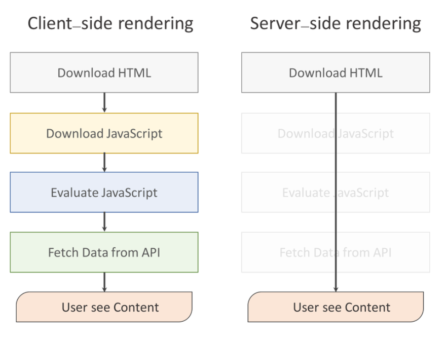

# Chapter 4. Single Page Application

전통적인 웹 방식은 새로운 페이지 요청 시마다 정적 리소스가 다운로드되고 전체 페이지를 다시 렌더링하는 방식을 사용하므로 새로고침이 발생되어 사용성이 좋지 않다. 그리고 변경이 필요없는 부분를 포함하여 전체 페이지를 갱신하므로 비효율적이다.

`싱글 페이지 애플리케이션(single-page application, SPA)`은 서버로부터 완전한 새로운 페이지를 불러오지 않고, 현재의 페이지를 동적으로 다시 작성하는 웹 애플리케이션이다.

웹 애플리케이션에 필요한 모든 정적 리소스를 최초에 한번 다운로드한다. 이후 새로운 페이지 요청 시, 페이지 갱신에 필요한 데이터만을 전달받아 페이지를 갱신하므로 전체적인 트래픽을 감소할 수 있고, 전체 페이지를 다시 렌더링하지 않고 변경되는 부분만을 갱신하므로 새로고침이 발생하지 않아 네이티브 앱과 유사한 사용자 경험을 제공할 수 있다.

