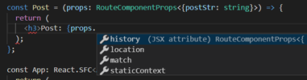

# Chapter 1. React with TypeScript


- TypeScript로 React 시작하는 방법
    - $create-react-app '프로젝트명' --scripts-version=react-scripts-ts

- Component에 Props랑 State를 붙여줘야 한다.
    - 클래스 컴포넌트는 Generic으로,
    - 함수형(stateless) 컴포넌트는 props만 매개변수로.
    - State는 없어도 되지만, Props는 없으면 안됨
        - state가 비어있을 땐, 따로 interface 만들지 않고 매개변수 state 자리에 {}를 삽입

- state랑 props는 interface로 표현해서 처리할 것
<br/>


# Chapter 2. Component

### Component
<br/>


- props
    - 컴포넌트 외부에서 컴포넌트로 넣어주는 데이터 (함수도 가능)
    - 컴포넌트 내부에서는 자신의 props 를 변경할수 없다.
        - 물론 돌아가면 가능은 하다.
    - 컴포넌트 외부에서 props 데이터를 변경하면, render 가 다시 호출된다.
- state
    - 컴포넌트 내부의 데이터
    - 클래스의 프로퍼티와는 다르다.
        - 프로퍼티는 변경한다고 render 가 호출되지 않는다는 점
    - 생성자 혹은 프로퍼티 초기 할당으로 state 를 초기 할당 해줘야 한다.
    - 내부에서 변경을 하더라도 setState 함수를 이용해야 render 가 호출된다.
<br/>


```ts
/* 클래스 컴포넌트 */

import * as React from 'react';
import Board from './Board';

interface GameState {
    history: Array<{squares: Array<'O' | 'X'>}>;
    stepNumber: number;
    xIsNext: boolean;
}

// "interface-name": [true, "never-prefix"]
// "no-empty-interface": false
class Game extends React.Component<{}, GameState> {
  constructor() {
    super({});
    ...
  }
  public render(): JSX.Element {
      ...
      return ();
  }
}

export default Game;
```

```ts
/* 함수형(stateless) 컴포넌트 - 1 */

import * as React from 'react';

interface SquareProps {
    value: any;
    onClick(): void;
}
  
function Square(props: SquareProps): JSX.Element {
    return (
        <button className="square" onClick={() => props.onClick()}>
            {props.value}
        </button>
    )
}

export default Square;
```

```ts
/* 함수형(stateless) 컴포넌트 - 2 */

import * as React from 'react';

interface SquareProps {
    value: any;
    onClick(): void;
}
  
const Square: React.SFC<SquareProps> = (props) {
    return (
        <button className="square" onClick={() => props.onClick()}>
            {props.value}
        </button>
    )
}
```

#### state는 초기 할당을 해줘야 한다.

```ts
// 첫 번째 방법
// constructor 없이 설정
class App extends React.Component<{ name: string; }, { age: number; }> {
  public state = {
    age: 35
  };
  render() {
    return ( ... );
  }
}

// 두 번째 방법
// constructor 안에서 설정
class App extends React.Component<{ name: string; }, { age: number; }> {
  constructor(props: { name: string; }) {
    super(props);
    this.state = {
      age: 35
    };
  }
  render() {
    return ( ... );
  }
}
```
<br/>


### Lifecycle

> 리액트 버전 16.3에서 새로운 라이프 사이클 `getDerivedStateFromProps`와 `getSnapshotBeforeUpdate` 2개가 소개되었다.
기존에 사용하던componentWillMount, componentWillUpdate, componentWillReceiveProps 는 점차 지원이 중단되어 버전 17에서는 완전히 삭제될 예정이라고 한다.
<br/>


- #### 컴포넌트 라이프사이클 초기 화면 로딩 시
    1. `constructor()`
        - 객체가 생성될 때 마다 호출됨
        - super(props)로 부모 클래스의 생성자를 호출하며, this.props로 접근이 가능
        - 전달된 함수들을 바인딩을 할 때도 보통 여기서 함
    
    2. `getDerivedStateFromProps()`
        - 컴포넌트 초기화 or 새로운 props를 받았을 때(Update Lifecycle) 호출됨
        - this.setState() 사용 대신 state를 업데이트 하기 위한 객체를 리턴하며 업데이트가 필요없을 경우 null값을 리턴함

        ```ts
        getDerivedStateFromProps(nextProps, prevState) { // props에서 받아온 값을 state에 동기화
            if(nextProps.value !== prevState.value) { // props의 값이 바뀌었다면
                return {value: nextProps.value}; // 변경된 객체 리턴
            }
            return null; // 아니면 null 리턴
        }
        ```

    3. `render()`
        - 이 메소드가 호출되면 `this.props`와 `this.state`가 분석되며 리액트 엘리먼트를 리턴함
        - state를 변경하면 안됨
        - shouldComponentUpdate()가 false를 리턴할 경우 호출되지 않음
        - 브라우저와 직접 상호작용하면 안되고, componentDidMount() 안에서 해야함
    
    4. `componentDidMount()`
        - 전체 라이프사이클에서 한 번만 호출됨
        - 컴포넌트가 브라우저에 나타난 후에 호출됨
<br/>


- #### 첫 화면 랜더링 후 props가 바뀔 경우
    1. `getDerivedStateFromProps()`
        - 여기서 또 나옴!
        - 컴포넌트 초기화 or 새로운 props를 받았을 때(Update Lifecycle) 호출됨
        - this.setState() 사용 대신 state를 업데이트 하기 위한 객체를 리턴하며 업데이트가 필요없을 경우 null값을 리턴함

    2. `shouldComponentUpdate()`
        - state가 바뀔 경우에는 바로 shouldComponentUpdate() 부터 라이프사이클이 진행됨
        - false를 리턴할 경우 render()가 호출되지 않음

    3. `render()`
        - 이 메소드가 호출되면 `this.props`와 `this.state`가 분석되며 리액트 엘리먼트를 리턴함
        - state를 변경하면 안됨
        - shouldComponentUpdate()가 false를 리턴할 경우 호출되지 않음
        - 브라우저와 직접 상호작용하면 안되고, componentDidMount() 안에서 해야함

    4. `getSnapshotCeforeUpdate()`
        - 컴포넌트 변화된 내용을 DOM에 반영하기 직전에 호출됨

    5. `componentDidUpdate()`
        - 컴포넌트 작업이 끝난 후 호출됨
        - prevProps, prevState, snapshot을 파라미터로 가질 수 있음

- #### 컴포넌트가 사라질 때
    1. `componentWillUnmount()`
        - 컴포넌트가 브라우저에서 사라지기 전에 호출됨
<br/>


### PropTypes
<br/>


React.PropTypes 를 더이상 함께 제공해 주지 않고, 별도의 라이브러리로 분리하였음
    
- 라이브러리로 제공되는 PropTypes
- Facebook 에서 제공하는 Flow
- TypeScript
<br/>


#### defaultProps

```ts
/* class defaultProps 사용법 */

ReactDOM.render(
  <App />,  // 사용시에 name props 를 쓰지 않으면,
  document.getElementById('root') as HTMLElement
);


export interface AppProps {
  name?: string;  // 물음표를 이용해 옵셔널하게 처리하고
}

// 클래스 안에 static 메서드를 이용해서 디폴트 값을 작성한다.
public static defaultProps = {
  name: 'Default'
};

// type definition 에 따르면, defaultProps는 Props 의 부분집합이다.
defaultProps?: Partial<P>;
```

```ts
/* function defaultProps 사용법 */

export interface AppProps {
  name?: string;
}

const StatelessComponent: React.SFC<AppProps> = (props) => {
  return (
    <h2>{props.name}</h2>
  );
}

StatelessComponent.defaultProps = {
  name: 'Default'
};
```

```ts
/* function defaultProps 사용법 2 */

export interface AppProps {
  name?: string;
}

// props spread
const StatelessComponent: React.SFC<AppProps> = ({name = 'Default'}) => {
  return (
    <h2>{props.name}</h2>
  );
}
```
<br/>


### 하위 컴포넌트 변경하기

상위 컴포넌트의 button을 클릭하여 하위 컴포넌트를 변경하려면,

- Grand Parent
    - Parent
        - Me
            - Child
                - Grand Chid
    - < button >< /button >

1. Grand Parent 컴포넌트에서 button 에 onClick 이벤트를 만들고,
2. 클릭하면, Grand Parent 의 state 를 변경하여, Parent1 로 내려주는 Props 를 변경
3. Parent1 의 Props 가 변경되면, Me 의 props 에 전달
4. Me 의 Props 가 변경되면, Child 의 props 로 전달
5. Child 의 Props 가 변경되면 Grand Child 의 props 로 전달 
<br/>


### 상위 컴포넌트 변경하기

하위 컴포넌트의 button을 클릭하여 상위 컴포넌트의 < p >의 내용을 변경하려면,

- Grand Parent
    - Parent
        - Me
            - Child
                - Grand Chid
    - < p >< /p >

1. Grand Parent 에서 함수를 만들고, 그 함수 안에 state 를 변경하도록 구현, 그 변경으로 인해 p 안의 내용을 변경.
2. 만들어진 함수를 props 에 넣어서, parent1 로 전달
3. Parent1 의 props 의 함수를 Me 의 props 로 전달
4. Me 의 Props 의 함수를 Child 의 props 로 전달
5. Child 의 Props 의 함수를 Grand Child 의 props 로 전달
<br/>


### PureComponent
<br/>

- 일반 컴포넌트
    - souldComponentUpdate()를 따로 구현하지 않으면 props, state 가 바뀌면 무조건 render
    - souldComponentUpdate()가 true를 리턴하기 때문

- Pure 컴포넌트
    - shouldComponentUpdate 가 다른 방식으로 구현되어 있는 것이다.
    - shallow compare(얕은 비교)
        - nested object 값의 변경을 감지하지 못한다.
        - immutable.js 를 사용하는 이유
    - 퓨어 컴포넌트를 쓰면 분명 성능상의 이점이 있음.
      하지만, 모든 컴포넌트를 Pure로 한다고 무조건 이점이 있는건 아니다.
    
    ```ts
    class App extends React.PureComponent<AppProps, AppState> {
        render() {
            return ( ... );
        }
    }

    export default App;
    ```
<br/>


# Chapter 3. React-router

### React Router?

- 특정 URL로 유저가 접근했을 때, URL을 해석하여 요청한 URL에 알맞는 React Component를 렌더링해서 보여주는 역할

- Facebook의 공식 라이브러리는 아니지만 React 관련 Router 라이브러리 중에서는 가장 많은 사용자 보유

- 클라이언트 사이드에서 이뤄지는 라우팅을 간단하게 해줌

- 게다가 서버 사이드 렌더링도 도와주는 도구들이 함께 딸려온다.

- 추가적으로, 이 라우터는 react-native 에서도 사용 될 수 있다.

- #### 그래서 이걸 왜 쓰는데?
    - url 주소나 특정상태에 따라서 view를 나누고, 여러 페이지들이 존재하는 서비스를 만들기 위해서.
    - #### AJAX 요청에 의해 서버로부터 데이터를 응답받아 화면을 생성하는 경우, 브라우저의 주소창의 URL은 변경되지 않는다. 이는 사용자의 방문 history를 관리할 수 없음을 의미하며, SEO(검색엔진 최적화) 이슈의 발생 원인이기도 하다. history 관리를 위해서는 각 페이지는 브라우저의 주소창에서 구별할 수 있는 유일한 URL을 소유하여야 한다.

- #### <a>태그를 쓰지 않는 이유
    - link tag를 사용하는 전통적인 웹 방식은 새로운 페이지 요청 시마다 정적 리소스가 다운로드되고 전체 페이지를 다시 렌더링하는 방식을 사용하므로 새로고침이 발생되어 사용성이 좋지 않다. 그리고 변경이 필요없는 부분를 포함하여 전체 페이지를 갱신하므로 비효율적이다.

- 설치 방법
    - `npm install --save react-router-dom @types/react-router-dom`
<br/>


- BrowserRouter
    - 다른 라우팅 컴포넌트(Route, Link)를 사용하기 위해서 기본적으로 감싸줘야 함
    - 오직 하나의 자식만을 가질 수 있음
    - `window.history.pushState()`로 동작하는 라우터
    - 이와 비슷하게 HashRouter는 Hash(#/)으로 동작하는 Router임
    - 보통 as를 이용하여 Router라는 이름으로 사용함

- Route
    - path 속성으로 경로지정
    - render, component, children 속성으로 렌더링
    - 실제 경로가 지정한 경로와 완벽히 매치되지 않더라도, 경로를 포함만 해도 렌더링
    - 정확히 매칭될 때만 렌더하고 싶은 경우 exact 옵션 사용
    - 컴포넌트에 match, location, history라는 객체를 넘김

- Link
    - `<a>태그`로 렌더링되고 사용법도 비슷하지만,
    - 실제 동작은 `<a>태그`와 다르게 페이지 전체를 리로드하지 않고
    - 필요한 부분만 리로드하게 됨

```ts
import * as React from 'react';
import { BrowserRouter as Router, Link, Route, RouteComponentProps } from 'react-router-dom';
import './App.css';

interface AppProps {
  name?: string;
}

const Home = () => {
  return (
    <h3>Home</h3>
  );
};

const Post = (props: RouteComponentProps<{postId: string}>) => {
  function goNextPost() {
    /* 아래와 같은 코드
    const currPostId = props.match.params.postId;
    const nextPostId = +props.match.params.postId + 1 + '';
    const { pathname } = props.location;
    const nextPath = pathname.replace(currPostId, nextPostId);

    props.history.replace(nextPath);
    */ 
    const nextPostId = +props.match.params.postId + 1;
    props.history.push(`/posts/${nextPostId}`);
  }

  return (
    <div>
      <h3>Post: {props.match.params.postId}</h3>
      //Next Post 버튼
      <button onClick={goNextPost}>Next post</button>
      //쿼리 스트링 파싱
      <p>{new URLSearchParams(props.location.search).get('body')}</p>
    </div>  
  );
};

const App: React.SFC<AppProps> = (props) => {
  return (
    <Router>
    <div>
      <nav>
        <ul>
          <li><Link to="/">Home</Link></li>
          <li><Link to="/intro">소개</Link></li>
        </ul>
      </nav>
      <Route exact={true} path="/" component={Home} />
      <Route path="/intro" render={() => <h3>소개</h3>}/>
      <Route path="/posts/:postId" component={Post}/>
    </div>
    </Router>
  );
};

export default App;
```


<br/>


- match 객체
    - <Route>의 `path`에 정의한 것과 매치된 정보를 담고있음

- location 객체
    - 브라우저의 window.location 객체와 비슷함
    - URL을 다루기 쉽게 쪼개서 가지고 있음

- history 객체
    - 브라우저의 window.history 객체와 비슷함
    - 주소를 임의로 변경하거나 되돌아갈 수 있음
    - 주소를 변경하더라도 SPA 동작방식에 맞게 페이지 일부만 렌더링


# Chapter 4. Server-side-rendering


SPA는 트래픽을 감소시키고 사용자에게 더 나은 경험을 제공했다. 서버는 단지 JSON 파일만 보내주면 됐고, html을 그리는 역할은 클라이언트 측에서 자바스크립트가 수행하게 된 것이다. 이것이 바로 `클라이언트 사이드 렌더링(Client-side-rendering)`이다.

그리고 `서버 사이드 렌더링(server-side-rendering)`은 

> Angular JS 와 Backbone JS 같은 Single Page를 생성하기 쉬운 JS 프레임워크들이 등장했고, 특히 Angular JS는 러닝 커브를 제외한 많은 장점들 때문에 큰 호옹을 얻음

클라이언트 쪽이 점점 무거워지자 이에 반대로 `View를 효율적으로 관리하자는 철학`으로 `React`가 등장하게 되었다.

### 근데 React랑 Server Side Rendering이랑 뭔상관입니까?

