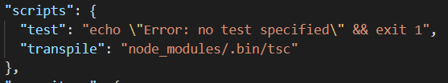
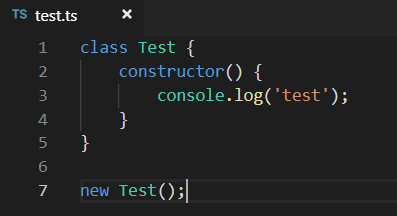
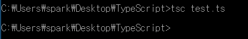
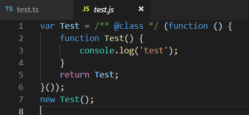

레파지토리 다시 만들어서 챕터별로 푸쉬, 이미지 폴더 만들어서 보기좋게 정리

# Chapter 1. TypeScript Overview
<br/>


- ### 타입스크립트 
    - 프로그래밍 언어
    - Compiled Language
    - 전통적인 Compiled Language 와는 다른 점이 많다.
    - 그래서 ' Transpile ' 이라는 용어를 사용하기도 함.
    - 자바스크립트는 ' Interpreted Language '
<br/>


- ### Traditional Compiled Language
    - 컴파일된 코드는 프로세서에 따라 다르다.
    - 소스 코드에서는 OS 에 따라 라이브러리가 다르다.
    - 컴파일된 코드는 작은 크기에 최적화된다.
    - 일반적으로 실행시 기계어로 바꾸는 방식(인터프리터 언어)보다 빠르다.
    - 컴파일된 코드들은 ' Linking ' 이라는 과정을 통해 실행 파일로 만들어 진다.
        - 컴파일된 여러 목적 코드들을 합치고 라이브러리를 추가한다.
        - ' Linking ' 하는 프로그램을 ' Linker ' 라고 한다.
        - 컴파일이라는 말을 링킹까지 포함하여 말하기도 한다.
    - 컴파일된 코드는 프로세서에 의존적이다.
    - 컴파일된 코드는 작은 크기에 최적화된다.
    - 일반적으로 실행시 기계어로 바꾸는 방식(인터프리터 언어)보다 빠르다.
        - 실행시 기계어로 바꿔주는 연산이 필요없기 때문이다.
<br/>


Compiled | Interpreted
:--------|:---------
컴파일, 컴파일러, 컴파일 시점 필요 | 컴파일, 컴파일러, 컴파일 시점 필요 X
컴파일된 결과물을 실행 | 코드 자체를 실행 (런타임에 실행됨)
<br/>


# Chapter 2. 개발 환경 구축 및 컴파일러 사용
<br/>


<br/>


#### 타입스크립트 컴파일러 설치

- npm
    - npm i typescript -g
    - node_modules/.bin/tsc
    - tsc source.ts
- Visual Studio plugin 설치
    - Visual Studio 2017 / 2015 Update 3 에서는 디폴트로 설치되어 있음
    - 아니면 설치
<br/>


#### 에디터 설치 (IDE)

- Integrated Development Environment
    - 코딩, 디버그, 컴파일, 배포 등 프로그램 개발에 관련된 모든 작업을 하나의 프로그램 안에서 처리하는 환경을 제공하는 소프트웨어
    - Visual Studio
    - Visual Studio Code
        - https://code.visualstudio.com/
        - 타입스크립트로 만들어졌기 때문에 타입스크립트에 대한 지원이 강력
    - IntelliJ IDEA / WebStorm
        - https://www.jetbrains.com/
        - 특별한 플러그인 설치가 필요 없음

<br/>


#### 간단한 컴파일러 사용 예제

package.json (npm init 하면 생성됨)<br/>
<br/>
<br/>
<br/>
<br/>


- 컴파일 옵션 설정: tsconfig.json (tsc --init 하면 생성됨) 수정
- tsconfig.json 파일이 생성된 후에는 tsc test가 아니라 tsc로 컴파일 가능
- tsc -w 는 watch모드로 실행 (코드가 변경되면 감지해서 새로 컴파일됨)
<br/>


- Compiler
    - VS Code 에 컴파일러가 내장되어 있습니다.
    - 내장된 컴파일러 버전은 VS Code 가 업데이트 되면서 올라갑니다.
        - 그래서 컴파일러 버전과 VS Code 의 버전은 상관 관계가 있습니다.
    - 내장된 컴파일러를 선택할수 있고, 직접 설치한 컴파일러를 선택할 수도 있습니다.
- tslint (에러는 아니지만, 규칙을 지킬 수 있도록 잡아줌)
    - npm i typescript tslint (로컬)
    - tslint --init
<br/>


# Chapter 4. Compiler Options
<br/>


- #### compileOnSave
    - 파일을 저장하면 자동으로 컴파일, 최상단에 설정해야 함, 특정 IDE를 사용해야만 함.(Visual Studio 2015 이상, atom-typescript 플러그인)
- #### extends
    - tsconfig.json을 상속받아 사용할 수 있음.
- #### compilerOptions
    - target : 어떤 JS형태로 컴파일 할 것인가(default : es3)
    - lib : 기본 type definition 라이브러리를 어떤 것을 사용할 것이냐.
    default는 target에 맞는 해당 lib를 사용.

> ex) target이  'es5'면, 디폴트로 dom, es5, scriptshot를 사용

- #### files, include, exclude
    - 컴파일 대상인 파일 설정, 셋다 설정이 없으면 전부다 컴파일
    - files
        - 상대 혹은 절대 경로의 리스트 배열
        - files 키워드로 파일을 정함.
          "files": [ "src/index.ts" ]
    - incude/exclude로 경로를 지정할 수 있다.
    - exclude 
        - 설정 안하면 다음 4가지 node_modules, bower_components, jspm_package, <outDir> 을 default로 제외함
        - <outDir>은 항상 제외(include에 있어도)
    - 우선순위(강도) : files > exclude > include

- #### @types
    - TypeScript 2.0 부터 사용 가능해진 내장 type definition 시스템
    - default 는 node_modules/@types/ 안의 모듈이름에서 찾아옴.
    - typeRoots/types : type definition의 위치를 설정.
        - 배열 안의 모듈 혹은 node_modules/@types/ 안의 모듈 이름에서 찾아옴.
        - [] 빈 배열을 넣는다는 건 이 시스템을 이용하지 않겠다는 것.
    - typeRoots 와 types를 같이 사용하지는 않음.
- #### target
    - 빌드의 결과물을 어떤 버전으로 할 것인가
    - default는 es3.
- #### lib
    - 기본 type definition 라이브러리를 어떤 것을 사용할 것인가
    - default일 때,
        - target 이 'es3' 이면, default로 lib.d.ts 를 사용합니다.
        - target 이 'es5' 이면, default로 dom, es5, scripthost 를 사용합니다.
        - target 이 'es6' 이면, default로 dom, es6, dom.iterable, scripthost 를 사용합니다.
​   - lib 를 지정하면 그 lib 배열로만 라이브러리를 사용하니다.

- #### outDir
    - 컴파일 된 파일이 위치하는 장소

- #### sourceMap
    - 소스맵이란 : 자바스크립트를 한 파일로 합치거나 사이즈를 줄이기 위해서 압축하거나 난독화해서 배포하는 방식을 많이 취하는데 이 방법은 성능에는 좋지만 사실 디버깅이 어려워지는 문제가 있다. 소스맵은 이 원본 소스와 최종소스를 매핑해서 추적할 수 있는 방법

- #### module
    - 결과물로 어떤 모듈 표준을 사용할 것인가.
    - 디폴트 : target이 es6이면 es6가 디폴트, es6아니면 commonjs 디폴트, AMD나 System을 사용하려면, outFile이 지정돼야함.

- #### moduleResolution 
    - 모듈 가져올때 ts소스에서 모듈을 사용하는 방식.
    - node/classic이 있고 commonjs일때만 node라고 생각.

- #### paths/baseUrl/rootDirs
    - 상대경로 방식이 아닐때 사용.
<br/>


# Chapter 5. TypeScript Basic Types
<br/>


- JavaScript 기본 자료형을 포함
    - ECMAScript 표준에 따른 기본 자료형은 6가지
        - Boolean
        - Number
        - String
        - null
        - undefined
        - symbol (ECMAScript 6 에 추가)
        - array : object 형
- #### 사용자가 만든 타입은 결국 위의 기본 자료형들로 쪼개진다.
- 프로그래밍을 도울 몇 가지 타입이 더 제공된다.
    - any
    - void
    - never
    - enum
    - tuple: object형
<br/>


- Primitive Type
    - 오브젝트와 레퍼런스 형태가 아닌 실제 값을 저장하는 자료형

- literal
    - 변하지 않는 값 (상수와는 다름)

- Boolean / boolean
    - primitive(boolean)와 object(Boolean)는 다름
        - let isNotOk: boolean = new Boolean(true);  // 에러 발생
    - primitive 쓰는 것을 권장한다 함

- Number / number
    - primitive(number)와 object(Number)는 다름
    - primitive 쓰는 것을 권장한다 함

- String / string
    - 작은 따옴표나 큰 따옴표로 둘러쌈
    - 주로 Template String(ES6)도 많이 사용
        - `(backquote) 기호에 둘러쌓여 있다.
          `${expr}`

- undefined & null
    - undefiend와 null은 다른 모든 type의 subtypes이다.
     - number 에 null 또는 undefined를 할당할 수 있다는 의미.

- void
    - 타입이 없는 상태
    - `any`와 반대의 의미

- any
    - 어떤 타입이어도 상관없는 타입
    - 이걸 최대한 쓰지 않는 것이 핵심
        - 컴파일 타임에 타입 체크가 정상적으로 이뤄지지 않을 수 있기 때문
    - 그래서 컴파일 옵션 중 any를 쓰면 오류를 뱉도록 하는 nolmplicitAny도 있음

- Array
    - 사용 방법 두 가지
        - let list: Array< type>;  // 제네릭
        - let list: type[];

- Tuple
    - 타입이 한 가지가 아닌 일종의 배열
    - 사용할 때, 타입을 정확하게 잡아주지 않아서 안 쓰는 걸 추천
<br/>


# Chapter 5-2. var, let, const
<br/>


- #### var
    - ES5
    - 변수의 유효 범위 : 함수 스코프
    - 호이스팅 가능 (O)
    - 재선언 가능 (O)
- #### let, const
    - ES6
    - 변수의 유효 범위 : 블록 스코프 (친숙)
    - 호이스팅 불가 (X)
    - 재선언 불가 (X)

> 호이스트란, 변수의 정의가 그 범위에 따라 선언과 할당으로 분리되는 것을 의미한다. 즉, 변수가 할당이 되지 않아도(undefined) 사용할 수 있음. 

#### let 과 const 의 타입 추론
```typescript
let a: string = '에이';   // string
let b = '비이';           // string

const c: string = '씨이'; // string
const d = '디이';         // const  
```
<br/>


# Chapter 5-3. Type assersions
<br/>


- '타입이 이것이다' 라고 컴파일러에게 알려주는 것을 의미
- 그래서 행동에 대해서 작성자가 100% 신뢰하는 것이 중요
- 형변환과는 다름 (형변환은 실제 데이터 구조를 바꿔주는 것)
- 사용 방법 두 가지
    - 변수 as 강제 할 타입
    - <강제 할 타입>변수
> as Type 방법을 추천. React의 JSX 문법의 경우 <강제 할 타입>은 JSX의 문법과 겹치기 때문

```typescript
class Animal {
  eatFood() {
    /* ... */
  }
  isTiger() {
    /* ... */
  }
  isEagle() {
    /* ... */
  }
}

class Tiger extends Animal {
  run() {
    /* ... */
  }
}

class Eagle extends Animal {
  fly() {
    /* ... */
  }
}

function battle(Animal: Animal) {
  if (Animal.isTiger()) {
    Animal.run(); // run()은 Animal에 존재하지 없음
  } else if (Animal.isEagle()) {
    Animal.fly(); // fly()는 Animal에 존재하지 않음
  } else {
    Animal.eatFood();
  }
}
```

```typescript
function battle(Animal: Animal) {
  if (Animal.isTiger()) {
    (Animal as Tiger).run();
  } else if (Animal.isEagle()) {
    <Eagle>Animal.fly();
  } else {
    Animal.eatFood();
  }
}
```

#### Type Assersion이 Type Casting이 아닐 수 있는 이유
Type Casting은 런타임과 컴파일타임 모두에서 타입을 변경시키지만, Type Assersion은 컴파일타임에서만 타입을 변경시킨다.
<br/>


# Chapter 6-1. Type alias
<br/>


- Type alias
    - 직접 작성해야 하는 타입을 다른 이름으로 지정할 수 있다.
      타입을 새로 만드는 것은 아니고, 만들어진 타입의 refer로 사용하는 것
```ts
/* Aliasing Primitive */
type MyStringType = string;

const str = 'world';

let myStr: MyStringType = 'hello';
myStr = str;
```
```ts
/* Aliasing Union Type */
let person: string | number = 0;
person = 'Mark';

type StringOrNumber = string | number;

let another: StringOrNumber = 0;
another = 'Anna';
```
```ts
/* Aliasing Tuple */
let person: [string, number] = ['Mark', 35];

type PersonTuple = [string, number];

let another: PersonTuple = ['Anna', 24];
```
<br/>


# Chapter 6-2. Interface

#### ts의 인터페이스는 컴파일하면 js에서는 사라진다. (컴파일타임에 체크하는 용도)

```ts
/* class implements interface */
interface IPerson {
    name: string;
    age?: number;   // 선택적 속성
    hello(): void;
}

class Person implements IPerson {
    name: string;

    constructor(name: string) {
        this.name = name;
    }

    hello(): void {
        console.log(`안녕하세요! ${this.name} 입니다.`);
    }
}

const person: IPerson = new Person('Mark');
person.hello(); // 안녕하세요! Mark 입니다.
```
<br/>


# Chapter 6-3. Indexable Types

string 또는 number 자료형만 가능
```ts
interface User {
  [userName: string]: number | undefined;
}
```
- User 타입의 값을 임의의 string 타입 값 userName 으로 색인한 값 ([userName: string] <- 인덱스 시그니쳐)
- 즉, User[userName]은 number 또는 undefined 타입의 값이다.
- User['존재하지 않는 유저'] 따위의 값은 undefined로 할당할 수 있음.
<br/>


# Chapter 7. Class
<br/>


- 생성자 함수가 없으면, tsc가 디폴트 생성자를 자동으로 호출.

- 클래스의 프로퍼티 혹은 멤버 변수가 정의되어 있지만, 값을 대입하지 않으면 undefined로 처리된다. 즉, 오브젝트에 프로퍼티가 아예 존재하지 않는다. 
    - 따라서, null로 초기화 해놓는 습관이 좋아보임. (null과 undefined는 모든 type의 subtype)

- 접근제어자 (Access Modifier) 는 public 이 디폴트 이다.

```ts
class Person {
    // private 변수 앞에 _를 붙이는 코딩 컨벤션이 있음
    private _age: number;
    public name: string;

    constructor(age: number) {
        this._age = age;
    }
}

const person: Person = new Person(35);
person.name = 'Mark';
// person._age (X)
console.log(person); // Person {name: 'Mark', _age: 35}
```

```ts
class Parent {
    private privateProp: string | undefined;
    protected protectedProp: string | undefined;

    constructor() { }
}

class Child extends Parent {
    protectedProp = 'wow?';

    constructor() {
        super();  // 없으면 부모의 멤버에 접근 불가

        this.protectedProp = 'protected';
        // this.privateProp = 'private'; // (X)
    }
}


/* 
    컴파일된 js 파일.
    ts에서 부모 클래스의 멤버인지 자식의 멤버인지는 사라짐
*/
class Parent {
    constructor() {
    }
}
class Child extends Parent {
    constructor() {
        super();
        
        this.protectedProp = 'wow?';
        this.protectedProp = 'protected';
        // this.privateProp = 'private'; // (X)
    }
}
const p = new Child();
```

```ts
/* static 키워드를 붙힌 프로퍼티는 클래스.프로퍼티로 사용한다. */
class Person {
    public static CITY = "";
    private static lastName: string = 'Lee';
    private _name: string;
    private _age: number;
    
    constructor(name: string, age: number) {
        this._name = name;
        this._age = age;
     }

    public print() {
        console.log(`${this._name} ${Person.lastName} in ${Person.CITY}.`);
    }
}

const person: Person = new Person('Mark', 35);
Person.CITY = 'Seoul';
person.print(); // Mark Lee in Seoul.
```

```ts
/* 
    static을 private에도 붙일 수 있는데,
    export해서 쓸 때, 아래 코드처럼 
    외부 함수로 만들어서 쓰는 것과의 차이를 생각해보자.
*/
class Person {
    private static PROPERTY = '프라이빗 프로퍼티';
    private static METHOD() {
        console.log('프라이빗 메서드');
    }

    constructor() {
        console.log(Person.PROPERTY);
        Person.METHOD();
    }
}

//////////////////////////////////////////////

const PROPERTY = '모듈 내 변수';
function METHOD() {
    console.log('모듈 내 함수');
}

export class Person {
    constructor() {
        console.log(PROPERTY);
        METHOD();
    }
}

// 아래가 실행되는 context가 달라서(?) 비용이 더 발생하려나?
```

```ts
/* 싱글톤 패턴 */
class Preference {
    public static getInstance() {
        if (Preference.instance === null) {
            Preference.instance = new Preference();
        }
        return Preference.instance;
    }
    private static instance: Preference = null;
    private constructor() { }
}

const p: Preference = Preference.getInstance();
```
<br/>


# Chapter 8. Generic
<br/>


- C++의 템플릿같은 느낌
- `any`를 쓰지 않는 이유
    - `any`를 이용하여 구현하는 것이 쉬운 방법일 수 있지만, any로 구현하면 저장하고 있는 자료의 타입이 모두 같지 않을 수 있다. 그렇게 되면, 런타임에서 자료에 접근할 때마다 타입 검사를 해줘야 한다.

```ts
/* Generic Class */
class Person<T> {
    private _name: T;
    private _age: number;

    constructor(name: T) {
        this._name = name;
    }
}

new Person('Mark');
```

```ts
/* Generic with extends */
class Person<T extends string | number> {
    private _name: T;
    private _age: T;

    constructor(name: T) {
        this._name = name;
    }
}

new Person('Mark');
new Person(35);
```

```ts
/* Generic with multiple types */
class Person<T, K> {
    private _name: T;
    private _age: K;

    constructor(name: T, age: K) {
        this._name = name;
        this._age = age;
    }
}

new Person('Mark', 35);
```

#### type lookup system

```ts
interface Person {
    name: string;
    age: number;
}

function getProperty(obj, key) {
    return obj[key];
}
```

위의 코드에서 obj와 key와의 관계를 증명할 수 없는 문제가 있음. 엉뚱한 key를 넣으면 obj에서 찾지 못해서 undefined가 나온다.

이를 해결하기 위한 것이 `type lookup system`이다.

```ts
interface Person {
    name: string;
    age: number;
}

const person: Person = {
    name: 'Mark',
    age: 35
};

function getProperty<T, K extends keyof T>(obj: T, key: K): T[K] {
    return obj[key];
}

function setProperty<T, K extends keyof T>(obj: T, key: K, value: T[K]): void {
    obj[key] = value;
}

getProperty(person, 'name');
setProperty(person, 'name', 'Anna');

// getProperty(person, 'name1');  // 오류 발생
```
<br/>


# Chapter 9. iterator
<br/>


- for..of
    - es3
        - for (var i = 0; i < array.length; i++)
    - es5
        - array.forEach
            - return 으로 순회를 탈출할 수 없다.
    - es6
        - for (const item of array)
            - 배열에서만 사용이 가능

- for..in
    - 지양할 것. index가 number가 아니라 string으로 나오고, 루프가 무작위로 순회할 수도 있기 때문에.
    
- iterator
    - Iterator는 반복을 위해 설계된 특정 인터페이스가 있는 객체이다. 
    - 모든 Iterator 객체는 결과 객체를 반환하는 next() 메서드를 가지고 있다. 
    - 결과 객체에는 두 가지 프로퍼티, 즉 다음 값인 value와 반환할 값이 더 이상 없을 때 true 인 부울 값인 done 프로퍼티가 존재한다. 
    - Iterator는 값 컬렉션 내의 위치에 대한 내부 포인터를 유지하고 next() 메서드를 호출할 때마다 다음 적절한 값을 반환한다.
    - 마지막 값이 반환된 후에 next()를 호출하면 메서드는 done을 true로 리턴하고 value는 Iterator의 리턴 값을 포함한다. 이 리턴 값은 데이터의 일부가 아니며 관련 데이터의 마지막 부분이거나 그러한 데이터가 없으면 undefined이다. 

```ts
/* lib.es6.d.ts */

interface IteratorResult<T> {
    done: boolean;
    value: T;
}

interface Iterator<T> {
    next(value?: any): IteratorResult<T>;
    return?(value?: any): IteratorResult<T>;
    throw?(e?: any): IteratorResult<T>;
}

interface Iterable<T> {
    [Symbol.iterator](): Iterator<T>;
}

interface IterableIterator<T> extends Iterator<T> {
    [Symbol.iterator](): IterableIterator<T>;
}
```

```ts
/* Custom Iterable */

class CustomIterable implements Iterable<string> {
    private _array: Array<string> = ['first', 'second'];

    [Symbol.iterator]() {
        var nextIndex = 0;

        return {
            next: () => {
                return {
                    value: this._array[nextIndex++],
                    done: nextIndex > this._array.length
                }
            }
        }
    }
}

const cIterable = new CustomIterable();

for (const item of cIterable) {
    console.log(item);
}
```
<br/>


Chapter 10. decorator
<br/>


- 실제 클래스 정의에 코드 주입을 가능하게 해준다.

- Decorator 종류
    - Class Decorator
    - Property Decorator
    - Method Decorator
    - Parameter Decorator

- Decorator 코드 작성 준비
    - step1. 프로젝트 생성
        - mkdir ts-decorator
        - cd ts-decorator
        - yarn init -y
    - step2. typescript 설치
        - yarn add typescript -D
    - step3. tsconfig 설정
        - node_modules/.bin/tsc --init
        - experimentalDecorators 추가
    - step4. vscode 컴파일 설정
        - ${workspaceRoot}/node_modules/.bin/tsc
        - command + shift + 'B'

- 클래스 데커레이터
    - 데커레이터 함수는 클래스를 정의할 때 한 번만 호출된다.

- 다중 데커레이터
    - 호출은 반대 순서로 된다.(클래스에 가까운 쪽부터)

- 데커레이터 팩토리
    - 인자를 받고, 데커레이터를 반환하도록 데커레이터를 감싸놓은 함수

```ts
function hello(constructorFn: Function) {
    console.log(constructorFn);  // 인자로 넘어온 것은 Person의 생성자 함수
}

function helloFactory(show: boolean) {
    if (show) {
        return hello;
    } else {
        return null;
    }
}

@helloFactory(true)
class Person {
}
```

- 속성 데커레이터
    - 


<br/>


# Chapter 12. React with TypeScript

- ### ReactJs로 만들어진 다음 프로젝트를 Ts로 마이그레이션 하기
    - https://github.com/saystone/tic-tac-toe
    - ts-test2 폴더 참고

> TypeScript로 React 시작하는 방법
>> $create-react-app '프로젝트명' --scripts-version=react-scripts-ts
<br/>


- Component에 Props랑 State를 붙여줘야 한다.
    - 클래스 컴포넌트는 Generic으로,
    - 함수형(stateless) 컴포넌트는 props만 매개변수로.
    - State는 없어도 되지만, Props는 없으면 안됨
        - state가 비어있을 땐, 따로 interface 만들지 않고 매개변수 state 자리에 {}를 삽입

> state랑 props는 interface로 표현해서 처리할 것
